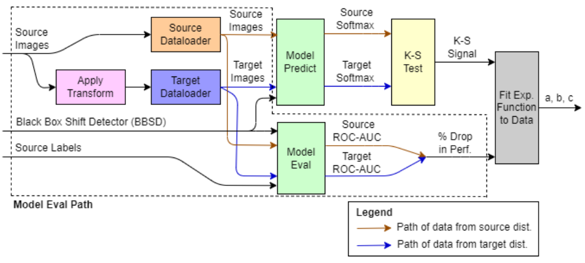
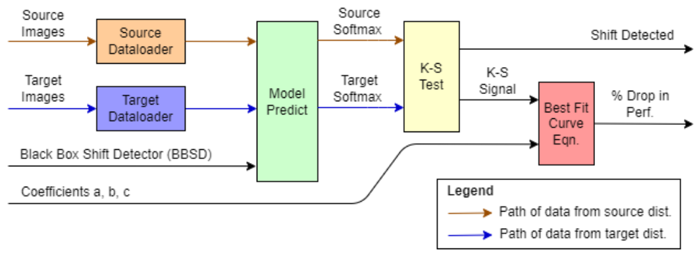

# FRAME: FRamework for AI Monitoring & Evaluation

This repository contains sample code for my Master's thesis **"Performance Monitoring of Medical Imaging AI"** at Imperial College London. For this project, I developed **FRAME** (**FR**amework for **A**I **M**onitoring & **E**valuation), a framework for performance monitoring which can detect shifts in data distribution and estimate the performance drop of a model in production.

FRAME is designed to be applicable in challenging
real-world scenarios, such as in the post-deployment phase, and in situations where ground truth labels are unavailable, samples are limited, and class distributions are unknown for the real-world data.

While FRAME can be applied to any computer vision task, this software implementation is specific to the following conditions:
- **Task**: Image classification
- **Dataset**: X-ray images in grayscale with a single channel
- **Model**: Model code in Pytorch

If your project meets these requirements, feel free to use FRAME *out of the box* by following the setup instructions below. If you run into any issues or errors, please [create a new issue](https://github.com/leeping-ng/frame/issues) and I'll do my best to address it.

## Setup
1. Install the required dependencies:
    ```
    > pip install -r requirements.txt
    ```
2. Prepare data from the *source* distribution and update paths in [config.yml](src/config.yml) accordingly:
    - `source_images_dir`: Store images from *source* distribution here
    - `source_metadata_path`: Create a *csv* file with 2 column headers `image` and `label`. Populate the `image` column with paths of all images in `source_images_dir`. Populate the `label` column with corresponding ground truth labels as integers.
3. If data from the *target* distribution is available, prepare the following and update paths in [config.yml](src/config.yml):
    - `target_images_dir`: Store images from *target* distribution here
    - `target_metadata_path`: Create a *csv* file with 2 column headers `image` and `label`. Populate the `image` column with paths of all images in `target_images_dir`. The `label` column can be left empty.
3. Prepare the BBSD model as an input to FRAME:
    - Update in [config.yml](src/config.yml):
        - `num_classes`: Number of classes for classification task
        - `batch_size`: Batch size for inference
        - `bbsd_checkpoint_path`: Path of stored checkpoint for PyTorch model with `.ckpt` extension
    - Migrate your PyTorch model code into [model.py](src/model.py). This module will be to be imported by [frame.py](src/frame.py). See [model_sample.py](src/model_sample.py) as an example.
  


## FRAME in Fit Mode

In this scenario, the user is close to deploying or has just deployed their model, has not seen any real-world data (from target distribution) yet, and wants to monitor performance in the future. FRAME will fit an exponential function of the form y=ae^bx+c on the data.



In [config.yml](src/config.yml), update the `performance_metric` setting under `fit` with the name of the evaluation metric that you are interested in and was used when you trained the model.

```
> cd src
> python frame.py --mode fit
```

FRAME will produce coefficients a, b, and c for future use.


## FRAME in Predict Mode

In this scenario, the user has deployed their model some time ago, has collected real-world data (from target distribution), and wants to estimate the model’s drop in performance (if any) to assess if corrective actions are needed. Prior to this, the user would have used Fit Mode to calculate the coefficients a, b, and c.



In [config.yml](src/config.yml), update the values of coefficients `a`, `b`, `c` setting under `predict` with the coefficients obtained earlier.

```
> cd src
> python frame.py --mode predict
```

FRAME will predict the estimated drop in performance of the previously chosen metric, and a Boolean if shift has been detected.